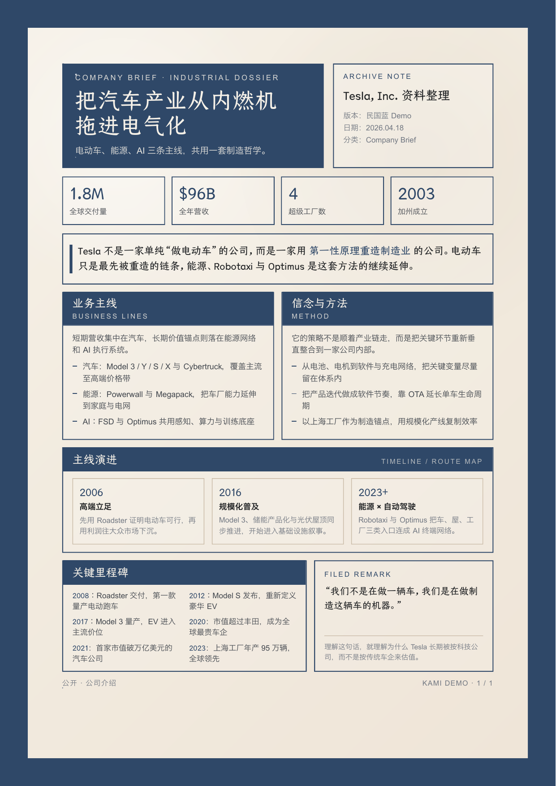

<div align="center">
  
  <h1>Kami</h1>
  <p><b>A Republican-era manuscript skin for AI document typesetting.</b></p>
</div>

<br/>

## Why

这个 fork 保留了原版 kami 的生成原理：`SKILL` 路由文档类型，模板负责版式骨架，design token 负责视觉语言，`scripts/build.py` 负责页数、字体和 CSS 约束校验。

变化集中在视觉层：从暖米纸 + 油墨蓝，转向 **深蓝外框 + 旧纸内页 + 档案蓝题签**。目标不是做报纸或海报复刻，而是把输出变成像一份整理过的民国文稿或馆藏档案。

## V1 Scope

- 正式支持：中文 `One-Pager`、`Long Doc`、`Letter`，其中 `Letter` 覆盖正式信件、推荐信、推荐函
- 视觉原则：深蓝外框 `#243851`、旧纸底 `#EBE5DD`、明显 padding、蓝色题签、档案式边框
- 暂不主推：英文模板、简历、作品集、slides

## Use Naturally

Just tell Claude what you need: "帮我生成一份白皮书", "生成一份项目方案", "帮我写一份推荐信", "写一封推荐函", "帮我把这些内容排版成好看的 PDF".

The skill auto-triggers from the request, no slash command needed. Chinese v1 routes to the framed Republican-era manuscript templates.

## Preview

<div align="center">
  <a href="assets/demos/demo-tesla.pdf">
    
  </a>
</div>

<p align="center"><sub>Chinese One-Pager demo · 民国文稿蓝主题 · <a href="assets/demos/demo-tesla.pdf">PDF</a></sub></p>

## Install

当前仓库是 fork 版主题改造，发布前请替换成你自己的 skill 源路径。若只是本地使用，可直接上传 ZIP 或把当前目录作为本地 skill 使用。

## Design Summary

八条核心约束：

1. 页面用深蓝外框包住旧纸内页，不再是普通白底文档
2. 强调色只有档案蓝 `#243851`
3. 中性灰偏纸本暖灰，不用冷蓝灰
4. 不新增字体依赖，继续使用仓耳今楷 / Newsreader / Source Han
5. Serif 字重固定 500，不用粗黑体
6. 行距延续原版：标题 1.1-1.3，正文 1.4-1.55
7. Tag 背景必须实色 hex，禁 `rgba()`
8. 装饰只做蓝色题签、双线内框和档案边框，不做纹理图片

完整规范见 [references/design.md](references/design.md)，速查见 [CHEATSHEET.md](CHEATSHEET.md)。

## Build

```bash
python3 scripts/build.py --verify one-pager
python3 scripts/build.py --verify long-doc
python3 scripts/build.py --verify letter
python3 scripts/build.py --check
```

`--verify` 会优先校验无占位符的 demo 样例，适合做视觉与页数回归；`--check` 继续扫描 CSS 约束与已迁移模板的 token 漂移。

## Notes

- 这不是运行时主题切换版，而是直接把当前 fork 改造成“民国文稿版”
- v1 不做竖排正文、纹理贴图、印章贴图和高拟物海报化
- 第二阶段若方向成立，再扩展到 `resume / portfolio / slides` 或英文主题
