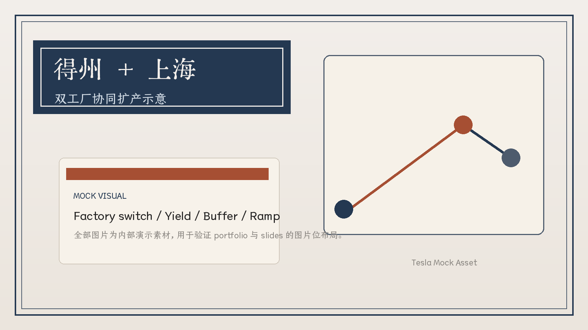
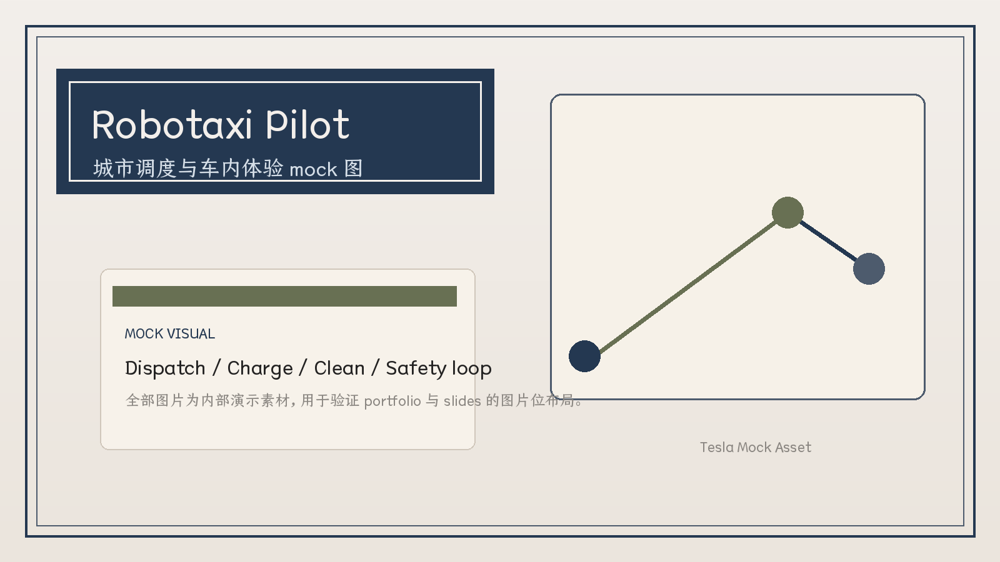
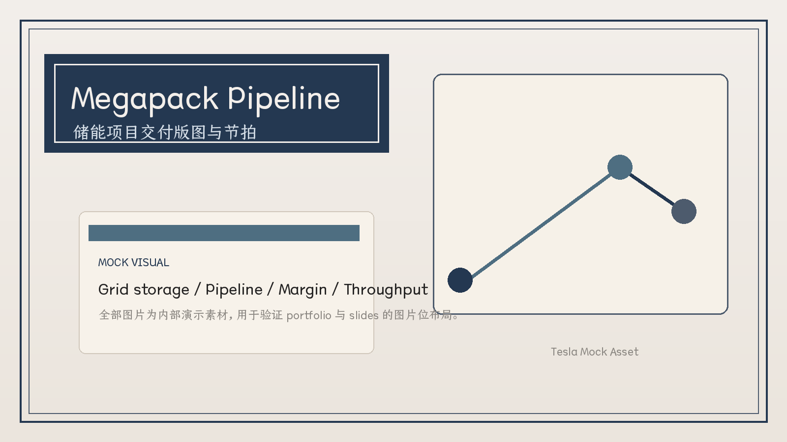
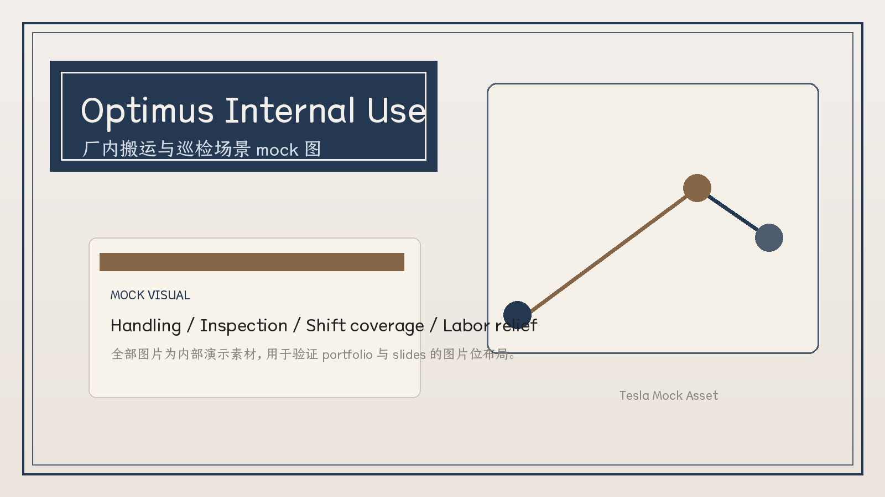

<!-- Generated from slides_spec.py. Do not edit by hand. -->

KAMI · REPUBLICAN MANUSCRIPT DEMO
<h1>Tesla 2027 增长与产能叙事</h1>
Robotaxi / Energy / Optimus / AI Infrastructure

此 deck 用 republican-manuscript skill 生成。 全部数据与图片均为 mock，用于验证 PPTX / Slidev 双产物路径。

04

growth bets

车 / 能源 / 算力 / 机器人

08

slides

dual-output deck

2026.04 · Mock Data · Internal Demo

TESLA 2027 MOCK BRIEFING01 / 08

---

01 · SECTION

核心判断

Tesla 的下一阶段估值不再只由整车交付驱动，而是由制造、软件、能源与机器人四条曲线共同决定。

BET 01
<h3>Robotaxi</h3>
把 FSD 资产从一次性卖车收入，转换成持续运营收入。

BET 02
<h3>Energy</h3>
储能业务用更稳定的交付节奏，平衡汽车周期波动。

BET 03
<h3>Factory OS</h3>
上海与得州工厂共享工艺、软件和供应链缓冲带。

BET 04
<h3>Optimus</h3>
机器人先在自家工厂落地，再逐步外溢到物流与服务。

四条曲线共用电池、算力、软件与工厂资产。

INVESTMENT THESIS02 / 08

---

02 · SECTION

上海与得州进入同屏扩产期

Mock 逻辑：一个工厂守住成本，一个工厂承接新平台切换，产能结构比单纯冲量更重要。

Mock visual · 双工厂协同示意

5.8M

年化产能

两地产线合计

41d

在制周转

切换期目标

<ul class="fixed-box image-focus-bullets" style="left:689.28px;top:357.12px;width:416.64px;height:155.52px;"><li>上海继续承担成熟车型与出口任务，稳定现金流与交付节奏。</li><li>得州优先给新平台、Robotaxi 版本与下一代低成本总装工艺。</li><li>核心不是绝对产能，而是切换效率、良率爬坡与供应链缓冲。 </li></ul>
OPERATIONS03 / 08

---

03 · SECTION

Robotaxi 不是一辆车，而是一套调度业务

Mock 逻辑：Robotaxi 的关键变量是上路城市、可用时长、调度效率和安全冗余，不只是硬件 BOM。

Mock visual · 城市内 Robotaxi 运营舱

12

pilot cities

首波试点城市

72%

utilization

高峰时段车辆利用

<ul class="fixed-box image-focus-bullets" style="left:689.28px;top:357.12px;width:416.64px;height:155.52px;"><li>先把封闭区域和固定路线跑顺，再扩大到开放路网。</li><li>运营系统要同时解决调度、充电、清洁和安全事件闭环。</li><li>软件收入开始与里程、活跃车次和城市密度直接相关。</li></ul>
AUTONOMY04 / 08

---

04 · SECTION

储能业务负责把增长波动磨平

Mock 逻辑：储能给 Tesla 带来的不是更性感的叙事，而是更可预测的交付节奏与更厚的项目储备。

Mock visual · Megapack 项目交付版图

438GWh

booked pipeline

在手项目储备

31%

gross margin

项目组合口径

<ul class="fixed-box image-focus-bullets" style="left:689.28px;top:357.12px;width:416.64px;height:155.52px;"><li>储能订单周期长，但一旦排产稳定，现金流的可见度远高于整车业务。</li><li>电池分配不再只是车与车之间的竞争，而是车与电网项目之间的配置问题。</li><li>投资者会开始用项目完工率，而不只是交车数，来判断季度表现。</li></ul>
ENERGY05 / 08

---

05 · SECTION

Optimus 先证明工厂价值，再讲外部市场

Mock 逻辑：机器人最先成立的场景不是家庭，而是 Tesla 自己的搬运、分拣、巡检和夜班替代。

Mock visual · Optimus 在厂内搬运与巡检

18k

internal units

厂内部署节拍

23%

labor hours

重复工时替代

<ul class="fixed-box image-focus-bullets" style="left:689.28px;top:357.12px;width:416.64px;height:155.52px;"><li>第一阶段看单位替代工时，而不是对外销量。</li><li>机器人能力演进会反过来倒逼工厂物料标准化与工站重构。</li><li>只有先在自家场景跑通，外部客户才会把它视为工业设备而不是演示品。</li></ul>
ROBOTICS06 / 08

---

06 · SECTION

未来 18 个月看这五个检查点

如果这五个点依次兑现，Tesla 的叙事会从单一汽车股，切换到多业务平台公司。

Q3
<h3>Factory Switch</h3>
新平台切线期间的良率、库存与现金转换。

Q4
<h3>Robotaxi Pilot</h3>
首批城市能否跑出稳定运营天数与乘客复购。

Q1
<h3>Megapack Throughput</h3>
储能交付是否形成季度级稳定节拍。

Q2
<h3>Optimus Internal Use</h3>
厂内替代工时是否可量化并形成标准方案。

Q2
<h3>AI Cost Curve</h3>
算力投入是否沉淀成更高的软件附加值。

CHECKPOINTS07 / 08

---

<h1>先看兑现节奏，再看叙事想象力</h1>

Mock 数据 · Mock 图片 · Manuscript 版式 · PPTX / Slidev 双交付

Tesla 2027 Mock Briefing · Generated with Kami

END08 / 08

